# RetailPulse Learning Vault

This vault is your tutor and project map for building **RetailPulse**, a 30-day probabilistic multi-store sales forecasting and staffing-planning system.

## Start here

1. Read [[How to Use This Vault]].
2. Confirm the promise in [[Project Brief]].
3. Accept the boundaries in [[Scope and Non-Goals]].
4. Follow [[Master Roadmap]] and update [[Progress Dashboard]].
5. Use [[Weekly Study Rhythm]] when classes or research get busy.

## Project graph

```mermaid
flowchart LR
    A[Project definition] --> B[Data foundation]
    B --> C[Honest evaluation]
    C --> D[Global probabilistic model]
    D --> E[Challenger selection]
    E --> F[Staffing decision]
    F --> G[API and dashboard]
    G --> H[Automation and monitoring]
    H --> I[Portfolio release]
```

## Navigation

- Why and scope: [[Project MOC]]
- Dates and phases: [[Roadmap MOC]]
- Concepts: [[Learning MOC]]
- Implementation: [[Build MOC]]
- Final presentation: [[Portfolio MOC]]
- Risks and decisions: [[Tracking MOC]]

## Finish line

By **31 January 2027**, a clean clone must reproduce a leakage-safe baseline, train the champion, generate P10/P50/P90 forecasts, optimize staffing, serve results, monitor outcomes, and explain limitations. See [[Definition of Done]].
