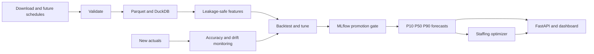

# System Architecture

## Why

The architecture prevents notebook-only logic and makes data, model, decision, and operating boundaries visible.

## Key boundary

The forecasting core is deterministic and testable. Prefect, FastAPI, Streamlit, and GCP call that core; they do not contain model logic.

## Alternatives

- **Notebook pipeline:** faster initially, weak to test and deploy.
- **Microservices:** excessive for one developer and one batch workflow.
- **Modular monolith:** selected; clear modules with one repository and deployable containers.

## Done when

Every box has one owning module and no feature is computed differently during training and serving.

Next: [[Technology Choices]], [[Build MOC]], and [[Prediction-Time Contract]].
